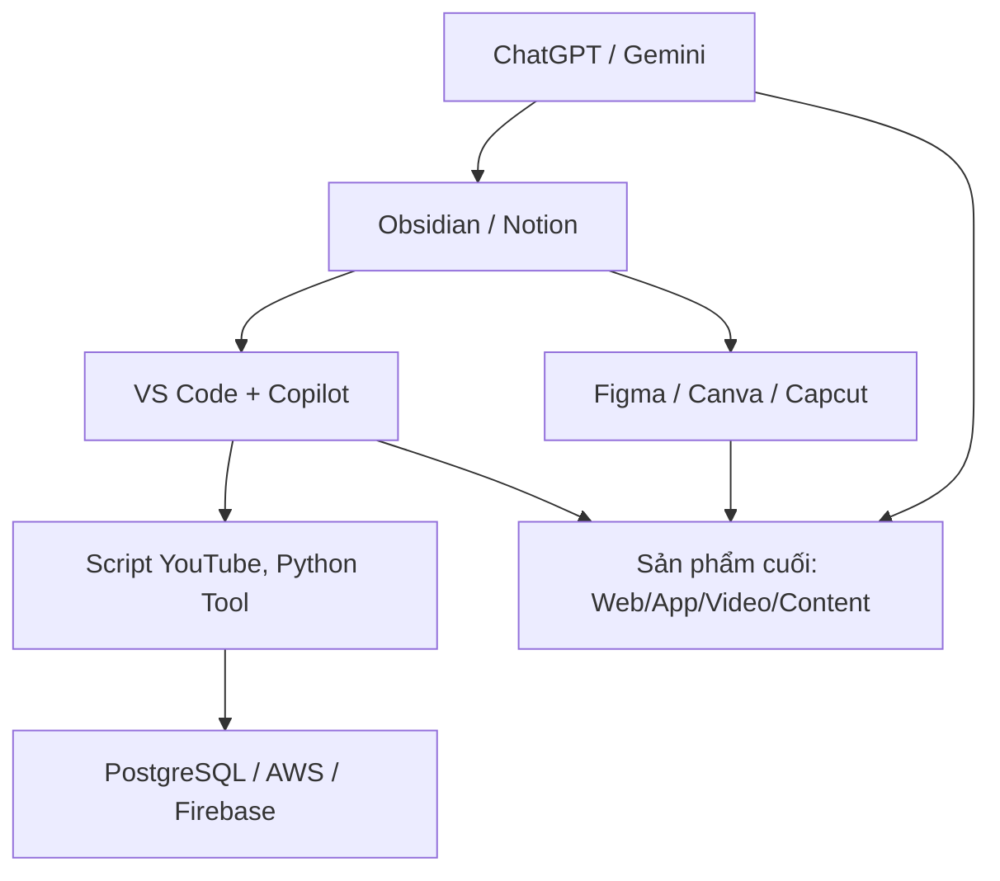

Tuyệt vời — bạn đang muốn xây dựng một **"Bộ não thứ 2" (Second Brain)** có tích hợp công cụ AI và dev hiện đại. Mình sẽ giúp bạn dựng một **hệ sinh thái tổng thể**, rồi chia nhỏ các phần cụ thể sau.

---

## 🧠 **Bộ não thứ 2 là gì?**

> Là hệ thống giúp bạn lưu trữ, tổng hợp, truy xuất và phát triển kiến thức, ý tưởng và sản phẩm nhanh — giống như bạn đang dùng chính “bộ não mở rộng” của mình.

---

## 🔧 **Công cụ bạn có thể tích hợp:**

|Mục tiêu|Công cụ|Vai trò|
|---|---|---|
|**Thu nhận thông tin**|ChatGPT, Gemini, YouTube|Tìm hiểu kiến thức, hỏi đáp|
|**Lưu trữ kiến thức**|Obsidian, Notion|Lưu note, kết nối ý tưởng|
|**Làm sản phẩm sáng tạo**|Canva, Figma, Capcut|Thiết kế, edit ảnh/video|
|**Viết code & tự động hóa**|VS Code, Copilot, Python, Script YouTube|Lập trình, bot, tool|
|**Lưu trữ & xử lý dữ liệu**|PostgreSQL, AWS|Backend, cloud, AI model|
|**AI hỗ trợ sáng tạo & dev**|ChatGPT, Copilot, Gemini|Viết code, sinh nội dung|

---

## 🏗️ **Kiến trúc tổng thể của bộ não thứ 2**

---

## 📦 **Chi tiết cách kết hợp:**

### 1. **Obsidian làm trung tâm kiến thức**

- Gắn plugin: GPT, Local Graph, Canvas view.
    
- Lưu tài liệu học, log dự án, ideas, tóm tắt video, hướng dẫn cài đặt.
    
- Tạo tag cho từng chủ đề (vue, aws, figma,...)
    

### 2. **GPT / Gemini**

- GPT: giải thích sâu, viết bài, xử lý tài liệu PDF, generate idea.
    
- Gemini: tìm kiếm thông tin Google, tạo nội dung nhanh từ dữ liệu thực.
    

### 3. **YouTube + Script + Capcut**

- Viết script bằng GPT hoặc Gemini.
    
- Lưu script trong Obsidian để tái sử dụng.
    
- Dựng video bằng Capcut → đăng TikTok, YT Shorts.
    

### 4. **VS Code + Copilot**

- Tạo script bot, tool crawl data, UI Vue/React.
    
- Copilot hỗ trợ bạn code nhanh.
    
- Tích hợp với Python backend và PostgreSQL.
    

### 5. **Canva, Figma**

- Canva: làm slide, post social, ảnh thumbnail.
    
- Figma: thiết kế UI/UX nếu làm sản phẩm phần mềm.
    

### 6. **Python, PostgreSQL, AWS**

- Xây web scraping, automation script, AI script.
    
- Lưu trữ dữ liệu người dùng, bài viết, script trong PostgreSQL.
    
- Deploy app/tool lên AWS: EC2, Lambda, Bedrock (nếu có AI).
    

---

## 🧠 Gợi ý luồng làm việc thực tế

1. **Nảy ý tưởng:** Dùng ChatGPT sinh ý tưởng => lưu vào Obsidian.
    
2. **Viết nội dung hoặc thiết kế UI:** Canva / Figma / GPT.
    
3. **Tạo nội dung video:** GPT viết script → Capcut dựng → xuất.
    
4. **Code tool AI / sản phẩm frontend/backend:**  
    VSCode + Copilot + Python → kết nối PostgreSQL → deploy AWS.
    
5. **Truy xuất lại kiến thức:** Tất cả note tổ chức trong Obsidian.
    

---

## 🧩 Nếu bạn muốn mở rộng:

- Tạo **Second Brain có tìm kiếm AI bằng RAG (Retrieval-Augmented Generation)**.
    
- Tự động **đồng bộ YouTube transcript vào Obsidian**.
    
- Tích hợp **Zotero / Readwise** để đọc nghiên cứu học thuật.
    

---

Bạn muốn mình giúp **thiết kế hệ thống cụ thể**, **chọn công nghệ triển khai**, hay **bắt tay code từng phần**?  
Ví dụ:

- Tạo project Vue quản lý kiến thức cá nhân.
    
- Code Python lấy video transcript rồi lưu PostgreSQL.
    
- Script auto tạo video từ GPT → Capcut.
    

Bạn muốn đi từ đâu trước?